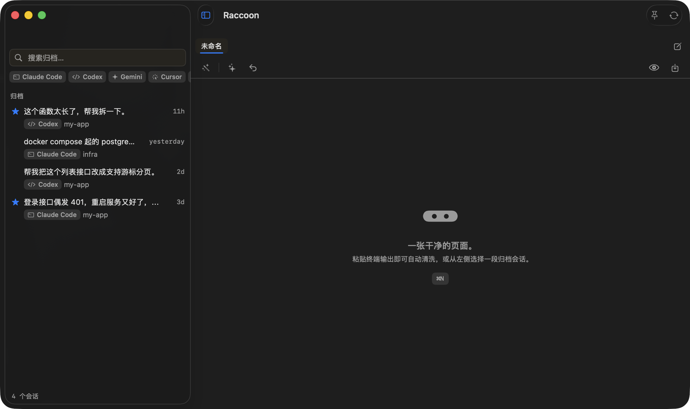
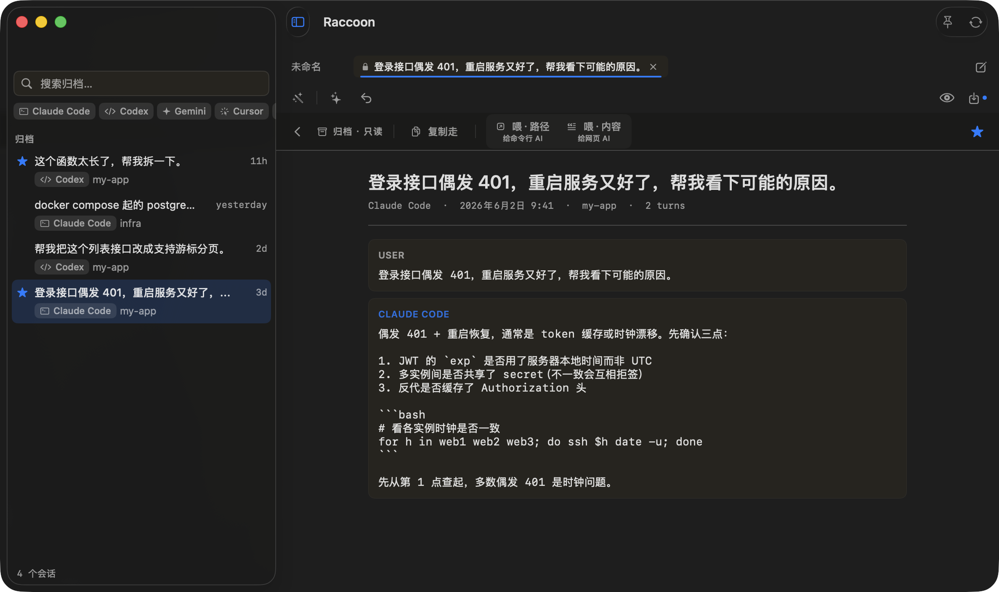
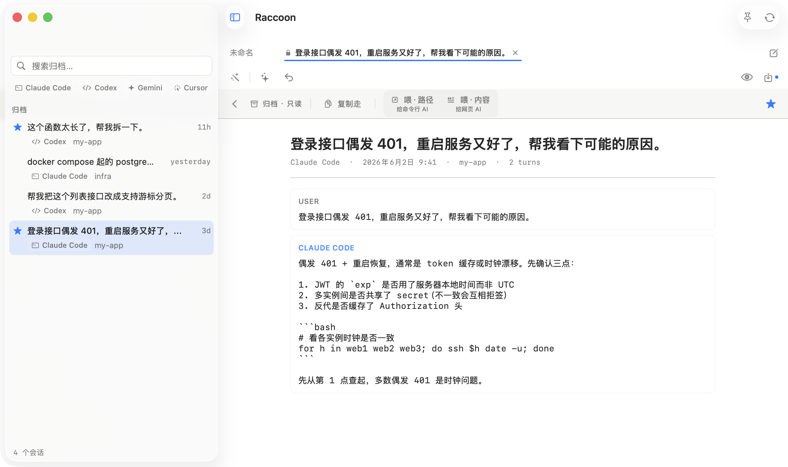

# Raccoon 🦝

**[English](README.md) | 简体中文**

**终端 AI 用户的本地记忆层。**

Raccoon 是一个可置顶、Sublime 风格的 Markdown 编辑器，给你的 AI 终端工作流一个持久的大脑——**100% 本地、零联网、免费、开源。**

吉祥物是浣熊，因为浣熊会「洗」东西——这正是 Raccoon 对你那些乱糟糟终端输出做的事。

> 应用界面是中英双语的，跟随你的系统语言。

---

## 它有何不同

这个领域的工具大多分两类：**只支持 Claude 的会话查看器**（如 Claude Explorer），和**会自动总结的 AI 记忆层**（如 mem0 / OpenMemory）。Raccoon 两者都不是。

| | **Raccoon** | 只支持 Claude 的查看器 | AI 记忆层（自动总结） |
|---|---|---|---|
| **工具覆盖** | 跨工具：Claude Code、Codex、Gemini、Cursor…… | 仅 Claude | 不一，多为记忆 API |
| **存什么** | 你的会话，**逐字保留**——不做 AI 总结 | Claude 日志的逐字视图 | 被 LLM 自动总结/改写 |
| **网络** | **由构造保证零联网**（没有任何网络代码） | 不一 | 通常依赖云/API |
| **源日志** | **只读**打开，绝不修改 | 读取访问 | 常被导入到另一套存储 |

上面这些是公开项目，仅作为公平、客观的类别示例列出——不含贬义。它们各自把相邻的问题解得很好；Raccoon 押注的是跨工具、逐字、可验证的本地化。

---

## 功能

### 1. 记（Archive）—— 留住会话，不丢上下文
一次拖放即可导入 Claude Code / Codex / 任何工具的 JSONL 记录。会话以纯 Markdown 文件存在你磁盘上——永远可读，无厂商锁定。

### 2. 洗（Clean）—— 去除终端噪声，绝不碰代码
粘贴原始终端输出，Raccoon 会去掉 ANSI 转义码、框线字符、换行残渣，同时让每一个代码块、diff、git 图保持逐字节完好。

### 3. 找（Search）—— 跨工具、跨会话全文检索
基于 SQLite FTS5 的全文搜索，覆盖每一条归档会话。离线、即时、无云端索引。

### 4. 喂（Feed）—— 把干净记录喂回任何 AI
一键复制清洗、排版好的记录，直接粘进 Claude、GPT、Gemini 或任何 AI 的上下文窗口——无需再次清洗。

### 5. 置顶（Pin）—— 浮动窗口，始终在最前
把 Raccoon 钉在终端或 IDE 之上，写代码时笔记一直可见。快捷键可配置。

---

## 隐私

**Raccoon 不发起任何网络连接。永远不。这是设计如此。**

- **零联网代码。** 应用不链接任何网络框架、不发起任何外连。源码里没有 `URLSession`、没有 `Network`/`CFNetwork`、没有任何分析/遥测 SDK、没有更新检查、没有 CDN 调用。整个应用开源——你可以自己审计。
- **100% 本地。** Raccoon 写入的每个文件都在 `~/Library/Application Support/Raccoon` 之下。你的源日志（`~/.claude`、`~/.codex` 及其他工具的记录）以**只读**方式打开，绝不修改。
- App Sandbox 当前是关闭的，因为应用需要读取你各工具的日志目录，而它们位于沙盒容器之外。零联网保证**不**依赖沙盒授权——它来自根本就没有网络代码，你可以用下面的命令自行验证。

### 自己验证隐私承诺

不用信我的话。零联网保证几秒钟就能验证：

```sh
# 1. 确认二进制没链接任何网络框架。
#    没有 URLSession / Network / CFNetwork 就意味着没有外连能力。
otool -L /Applications/Raccoon.app/Contents/MacOS/Raccoon | grep -Ei 'CFNetwork|Network|URLSession'
#    -> 什么都不打印

# 2. Raccoon 运行时，观察是否有任何网络活动：
nettop -p "$(pgrep -x Raccoon)"      # 显示零连接

# 也可以用这些工具验证：
# - Little Snitch：Raccoon 永远不会出现在它的连接日志里
# - LuLu：结果相同
# - 直接关掉 Wi-Fi —— Raccoon 照常运行，毫无影响
```

---

## 构建与运行

Raccoon 以源码形式分发，自行构建：

环境要求：macOS 14+、Xcode 16+、[XcodeGen](https://github.com/yonaskolb/XcodeGen)。

```sh
git clone https://github.com/asyncwhale/raccoon.git
cd raccoon
xcodegen generate
open Raccoon.xcodeproj    # 然后 ⌘R 构建并运行
```

Xcode 打开工程时，Swift Package Manager 会自动解析依赖（`RaccoonCore`、`KeyboardShortcuts`）。

**运行核心库测试**（不需要 Xcode IDE）：

```sh
cd RaccoonCore
swift test
```

---

## 截图

> 所有截图均使用**合成的演示会话**——没有任何真实记录。



打开一条会话——逐字保留、标注谁说的、代码原样不动，随时可喂回你的 AI：





---

## 关于

Raccoon 是我业余时间出于兴趣做的个人项目——想看看借助 AI 协作，一个开发者能把一个想法推到多完整：从需求到一个经过测试、完全本地、可用的 macOS 应用，独立完成。

比起产品本身，我更想分享的是它的开发过程。Raccoon 用一套「人主控 + 多 agent」的工作流构建：

- **并行 worker agent** 分工实现，各自负责不重叠的文件。
- **对抗式评审循环**——独立 agent 复核每一处改动，而不是轻信自报。
- **TDD 守护核心红线**：清洗引擎「绝不破坏代码」的保证由 236 个测试守住，含一套对抗式代码完整性语料。
- **隐私由构造保证**：零联网代码，源日志只读，可用 `otool` / `nettop` 自行验证。

---

## 许可证

MIT —— 见 [LICENSE](LICENSE)。需要 macOS 14+。
